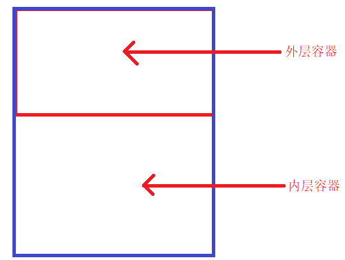

# Vue实战之喵喵电影
## day1 - 创建组件
### 页面组件
+ 电影页面组件
+ 影院页面组件
+ 我的页面组件
### 公共组件
+ 正在热映组件
+ 即将上映组件
+ 城市组件
+ 搜索组件
+ 影院列表组件
+ 登录组件
### 重点知识总结
1. 创建新的组件、路由、js等文件时，应该首先创建一个对应名字的文件夹，然后在文件夹里面创建的一个名为index的对应文件，这样既能够避免将所有的代码写在一起，而引起的代码复杂的问题，又能避免引入文件的路径复杂（只用找到对应名字的文件夹即可，系统会默认寻找当前目录下名为index的文件）
2. 当一个页面在注册公共的组件时，我们可以使用`component: () => import('[组件路径]')`这种方式按需导入，可以优化一定的性能。
3. 在导入外部文件时，由于当前项目的资源过多且目录结构复杂而引起的相对路径较为复杂的问题，我们可以通过`@`来解决，`@`表示的是当前项目src目录，因此我们可以通过`@`来使用绝对路径，引入外部文件。
4. 我们应该为一些路由增添重定向，例如首页重定向
```javascript
{
    path: '/*'
    redirect: '/movie'
}
```

## day2 - 请求数据，渲染页面
### 重点知识总结
1. 关于跨域问题的解决方法：利用axios使用反向代理来进行跨域，具体做法如下：
    + 在项目根目录建立`vue.config.js`文件【此文件为vue默认的配置文件】
    + 在文件中写入如下代码：
    + 
        ```javascript
        module.exports = {
            devServer: { //反向代理
                proxy: {
                    '/api': { //代理的接口
                        target: 'http://39.97.33.178', //代理的目标地址
                        changeOrigin: true //是否切换源
                    }
                }
            }
        }
        ```
    + 将axios注册到全局Vue中，在其他页面使用axios请求数据：
    + 
        ```javascript
        //全局注册axios
        import axios from 'axios'
        Vue.property.axios = axios //注册到Vue的原型上

        //使用axios请求数据
        this.axios.get('/api/...').then(...) //请求的地址，从代理的接口开始
        ```
2. 在进行数据绑定的时候，有些数据的形式并不是我们期望的。这时，我们需要使用过滤器来生成需要的数据【全局/局部过滤器的选择方式：此过滤器是否被项目中的多个地方共用，是则选用全局过滤器，否则选用局部过滤器】，需要注意的是：对于一些数据不同，而最终呈现的样式不同的情况，我们也可以使用过滤器。
3. 当需要根据输入的内容进行查询时，我们应该使用`watch`来监听属性【此属性是输入框双向绑定的数据】。
    + 为什么使用`watch`而不是使用`computed`？
        + 在`vue`的官方文档中写到：当需要在数据变化时执行异步或开销较大的操作时，watch是最有用的。
        + 使用 watch 选项允许我们执行异步操作 (访问一个 API)，限制我们执行该操作的频率，并在我们得到最终结果前，设置中间状态。这些都是计算属性无法做到的。
4. 在输入框中一直输入内容时，立即查询是非常消耗性能【函数防抖现象】，常见的解决方式有两种：
    + 使用定时器完成
    + 
        ```javascript
        /**
        * @desc 函数防抖
        * @param func 函数
        * @param wait 延迟执行毫秒数
        * @param immediate true 表立即执行，false 表非立即执行
        */
        function debounce(func,wait,immediate) {
            let timeout;

            return function () {
                let context = this;
                let args = arguments;

                if (timeout) clearTimeout(timeout);
                if (immediate) {
                    var callNow = !timeout;
                    timeout = setTimeout(() => {
                        timeout = null;
                    }, wait)
                    if (callNow) func.apply(context, args)
                }
                else {
                    timeout = setTimeout(function(){
                        func.apply(context, args)
                    }, wait);
                }
            }
        }
        ```
    + 使用axios自带的方法（连续发送多次请求，取消上一次请求）
    + 
        ```javascript
         methods: {
            getMsg () {
                let CancelToken = axios.CancelToken
                let self = this
                axios.get('http://jsonplaceholder.typicode.com/comments', {
                cancelToken: new CancelToken(function executor(c) {
                    self.cancel = c
                    console.log(c)
                    // 这个参数 c 就是CancelToken构造函数里面自带的取消请求的函数，这里把该函数当参数用
                })
                }).then(res => {
                    this.items = res.data
                }).catch(err => {
                    console.log(err)
                })


                //手速够快就不用写这个定时器了，点击取消获取就可以看到效果了
                setTimeout(function () {
                //只要我们去调用了这个cancel()方法，没有完成请求的接口便会停止请求
                self.cancel()
                }, 100)
            },
            //cancelGetMsg 方法跟上面的setTimeout函数是一样的效果，因为手速不够快，哦不，是因为网速太快，导致我来不及点取消获取按钮，数据就获取成功了
            cancelGetMsg () {
                // 在这里去判断你的id 1 2 3，你默认是展示的tab1，点击的时候不管你上一个请求有没有执行完都去调用这个cancel()，
                this.cancel()
            }
        }
        ```
## day3 封装组件，关联页面之间的数据
### 使用better-scroll组件来优化列表滑动效果
+ 适用的结构模型图如下：[外层容器的高度（better-scroll控制的区域）要比内层容器小一点，才能触发滑动效果]
    
+ 由better-scroll包裹的的区域必须只有一个根节点，如果不止一个根节点，则需要在外层增加一个div作为唯一的根节点。
+ better-scroll初始化的时间，是在页面的数据全部都渲染完毕之后。当我们需要在mounted生命周期中初始化这个插件时，我们需要将初始化的代码写在`this.$nextTick`方法的回调函数中【因为它可以保证，在页面完全将数据渲染完毕之后，才会触发它的回调函数】
```javascript
this.$nextTick( () => {
    BScroll({
        ...
    });
})
```
注意：
+ 由于项目中的包含多个相同的列表，因此会在多个地方用到better-scroll这个插件，因此，我们考虑将其封装成为一个公共的组件。在这个组件中，我们将滑动区域的结构制作成为一个插槽`slot`，引用时，直接将需要滑动的结构用自定义的标签名包裹即可。
+ 扩展：还可以用它实现下拉刷新/上拉加载的功能，例如监听scroll和touchEnd即可实现下拉刷新【详细请查看官方文档】，而针对不同的业务，即处理方式不同，我们可以在封装的组件中，定义统一的接口，采用ref/父子通信的方式则可以暴露给父组件。需要注意的是，当子组件调用父组件定义的方法时，记得使用call改变this指向当前实例。

### 使用本地存储，状态管理
+ 对于项目中一些长时间不会改变的数据，例如：城市信息。我们在第一次请求回数据之后，就通过键值对的方式存储到localStorage中，下一次直接从中读取即可。
+ 对于项目中的一些数据，在被多个不相关的页面共享时，我们可以采用状态管理（vuex）的方式来管理这些数据。
+ 使用状态管理时，也推荐采用模块化开发的方式，即在store文件夹下单独创建一个文件夹（city），在文件夹下新建一个index.js。store文件夹下的index.js添加内容如下：
```javascript
import Vue from 'vue'
import Vuex from 'vuex'
import city from './city'

Vue.use(Vuex)

export default new Vuex.Store({
  state: {
  },
  mutations: {
  },
  actions: {
  },
  modules: {
    city //store模块
  }
})

```
在city/index.js写入一下结构：
```javascript
const state = {}
const mutations = {}
const actions = {}
export default {
    namespaced: true,
    state,
    mutations,
    actions
}
```
在其他组件中访问数据方式：
`this.$store.state.[模块名字city].[state中的属性名]`
`this.$store.commit(city/[mutations中的方法名], [参数])`
注意：mutations中方法名称推荐全大写。

### 本地存储+状态管理
+ 当需要记录用户上一次访问页面操作的状态时，我们需要用到本地存储，例如，项目中需要记录用户上一次选择的城市，我们就可以将用户切换城市之后，把本地存储中的数据，用新数据覆盖即可。
+ 使用了状态管理的情况下，状态管理的初始数据需要从本地存储中获取。

### keepalive的使用
+ 当用户第二次进入某一个页面时，我们不希望它重新刷新一遍，这时我们可以使用keepalive标签将router-view标签包裹。如果用户第二次进入页面，就会读取缓存。
+ 还有一种场景，某些情况下，用户再次进入页面，希望再次刷新页面，由于我们只使用了keppalive，导致再次进入页面，不会再执行mounted等生命周期函数。这时我们需要使用由使用keepalive而产生的生命周期函数`activated`。
    + activated 生命周期在keep-alive 组件激活时调用。
    + 例如：当用户切换了城市之后，页面跳转到其他页面，此时就应该加载新的数据信息，而请求数据的代码就应该放在activated生命周期函数中。

### 自定义JS弹窗组件
+ 首先创建一个JS组件所在的文件夹，新建一个index.js文件，再此文件夹中像普通组件一样，创建一个新的模块（组件名称文件夹/index.vue）,写好必要的代码结构：
```javascript
<template>
    <div>
    </div>
</template>
<script>
export default {
    name: ''
}
</script>
<style scoped>
</style>
```
+ 在index.js文件中写入以下代码：
```javascript
import Vue from 'vue'
import MessageBox from './MessageBox' //引入刚刚创建的JS组件模块
export let messageBox = (function(){
     let defaults = { } //JS组件中需要的一些data/methods及默认值
    return (options) => { //options:用户传入配置项
        //根据用户额配置项，更新默认值
        for(let attr in options){
            defaults[attr] = options[attr];
        }
        let MessageBoxCom = Vue.extend(MessageBox);
        let vm = new MessageBoxCom({
            el: document.createElement('div'),
            data: {}, //将defaults中的数据项注册到组件的data中，即可以在html结构中使用
            methods: {}//将defaults中的方法注册到组件的methods中，可以在html结构中绑定相应的事件
        });
        document.body.appendChild(vm.$el); //将组件的html结构追加到页面中
    }
})();
```
+ 在其它页面使用此JS组件时，只需导入JS文件夹即可
```javascript
import {messageBox} from '@/components/JS'
```
+ 初始化组件
```javascript
 messageBox({
    title: '定位',
    content: nm,
    cancel: '取消',
    sure: '切换',
    handleSure: () => {
    }
});
```
## day4 电影详细页面开发
### 子组件的路由设计
+ 将电影详细页面看做是电影页面的子路由，由于电影页面已经存在一个子路由，因此需要使用“命名视图”，在一个组件里面需要定义多个子路由，则需要为`router-view`标签添加`name`属性，以此来区分子组件。例如，有如下子路由`<router-view name='detail'></router-view>`，则它的路由配置为：
```javascript
{
    path: 'detail/1/:movieId',
    components:{
        default: () => import('@/components/NowPlaying'), //默认展示的组件
        detail: () => import('@/views/Movie/detail') //detail为router-view的name属性的属性值
    }
}
```
    + 如果没有设置`default`【默认显示的组件】，它会不显示任何内容，即空白展示，因此我们最好时设置一下。
+ 动态路由及参数获取
    + 由父组件跳转到子组件页面时，需要传递参数，就可以用动态路由，例如`path: 'detail/1/:movieId'`
    + 子组件页面接收参数可以使用如下方式：

        1. `$route `
        ```javascript
        const User = {
            template: '<div>User {{ $route.params.id }}</div>'
        }
        ```
        2. 取代与 $route 的耦合[在组件中使用 $route 会使之与其对应路由形成高度耦合，从而使组件只能在某些特定的 URL 上使用，限制了其灵活性。]
        ```javascript
        const User = {
            template: '<div>User {{ $route.params.id }}</div>'
        }
        ```
        ```javascript
        const User = {
            props: ['id'],
            template: '<div>User {{ id }}</div>'
        }
            const router = new VueRouter({
            routes: [
                { path: '/user/:id', component: User, props: true },

                // 对于包含命名视图的路由，你必须分别为每个命名视图添加 `props` 选项：
                {
                    path: '/user/:id',
                    components: { default: User, sidebar: Sidebar },
                    props: { default: true, sidebar: false }
                }
            ]
        })
        + 如果 props 被设置为 true，route.params 将会被设置为组件属性
